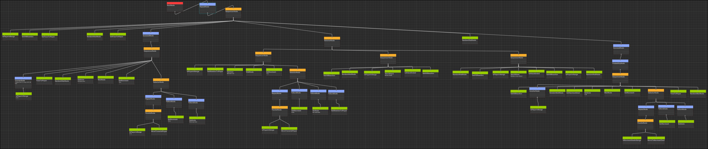
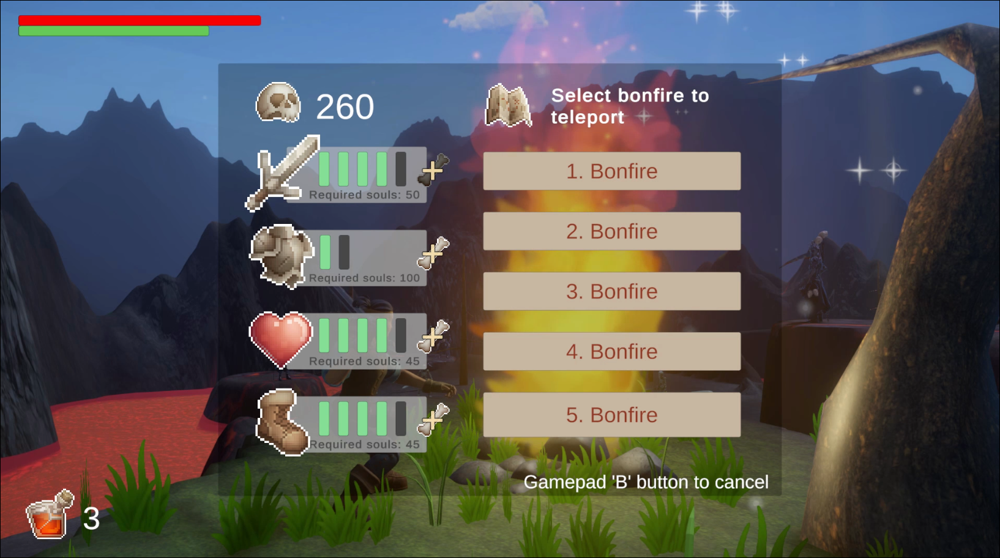
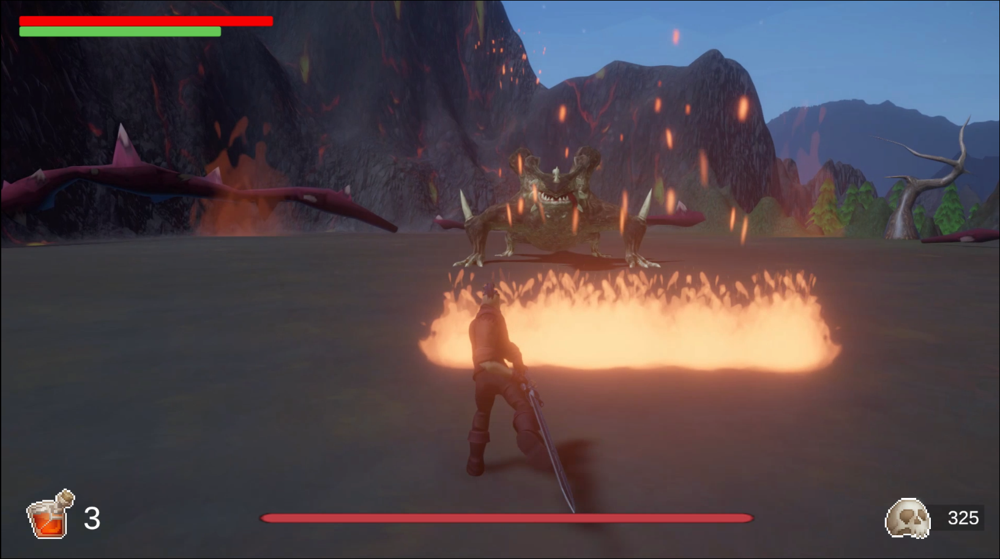

# Dragon Souls - Unity3D 
[Gameplay Video](https://youtu.be/3ClnxE3wdPI) :https://youtu.be/3ClnxE3wdPI  
I attempted to create a third-person action game in Unity inspired by God of War, featuring Souls-like mechanics. I used entirely free assets for this project. I found sound effects on the freesound website and royalty-free sounds on YouTube, often manipulating or combining them using digital audio workstations (DAW). I also made minor adjustments to obtain the desired animations. For the terrain, I prepared it using brushes and stamps, and I struggled mainly during the stage of finding suitable textures for the terrain. When using free assets, it can be challenging to maintain control over the artistic appearance of your game and ensure that different assets are cohesive. Nevertheless, I am satisfied with the Fortnite-like appearance that resulted.
I aimed to model the game's combat after God of War (2018). Since I couldn't find a suitable axe asset, I used a sword. Apart from that, I attempted to recreate various Souls mechanics within Unity.
Since I didn't plan the game in the beginning (it was just a project for trying some mechanics), some code patterns and principles have not been implemented perfectly, I'm aware of that. Also because of the same reason, I used both a state machine and a behavior tree structure. Skeleton enemies utilize the state machine, while other enemies use a different the behavior tree structures.

I used two royalty free theme music for this game from Alexander Hoff's youtube channel. 
- Music: Alexander Hoff - Drummers Unite  
[Epic Drum Music - Drummers Unite | Royalty Free](https://www.youtube.com/watch?v=3_u-f0qlfuw&ab_channel=AlexanderHoff)  
License: Creative Commons Attribution 4.0 International (CC BY 4.0)  
[https://creativecommons.org/licenses/...](https://creativecommons.org/licenses/by/4.0/)  
- Music: Alexander Hoff - Dragons  
[Orchestral Music - Dragons | Royalty Free](https://www.youtube.com/watch?v=TkdJX3nPeh8&ab_channel=AlexanderHoff)  
License: Creative Commons Attribution 4.0 International (CC BY 4.0)  
[https://creativecommons.org/licenses/...](https://creativecommons.org/licenses/by/4.0/)  

### The game mechanics & systems
- The sword can be thrown and recalled at will, similar to God of War.
- Alternatively, combat can be continued using fists instead of the sword.
- Enemies can be targeted (target system).
- One enemy npc uses statemachine, other five enemy npcs use behaviour tree.
- Behavior tree and a tool that visualizes the behavior tree using the UI Toolkit. (I learned and implemented this by watching The Kiwi Coder's YouTube videos).
- Player can roll (dodge), sprint, heal. Any movement consumes stamina.
- Souls of defeated enemies are collected, and these souls are lost upon the character's death.
- Collected souls can be used to enhance attack power, armor, health, and stamina at the bonfires. At the beginning of the game, there are three types of armor available, and when armor is upgraded, this change can be observed on the player character model (material change).
- Fast travel (teleportation) between bonfires is possible.
- After player death, teleportation or bonfire rest events, enemies spawn back to their inital position.
- Object pooling for every re-usable object. (Dragon and mage projectiles, souls particles)

#### Enemies and AI
- There are a total of 6 enemy NPCs: Skeleton, Mage, Minotaur, Bear, Slime, and Dragon (boss).
- Each enemy has its own unique behavior pattern. I dedicated a significant amount of time to make them distinct from each other.
- As mentioned earlier, only skeleton enemy doesn't use a behaviour tree, instead it uses a state machine.
- You can find the different behaviour trees of enemies. (Behaviour tree of the dragon (boss) was too big so i couldn't find a way to screenshot it properly)
##### Slime 

##### Minotaur

##### Mage

##### Bear

#### Dragon (boss)

## In-Game Footage
 
 
  
  
  
 

